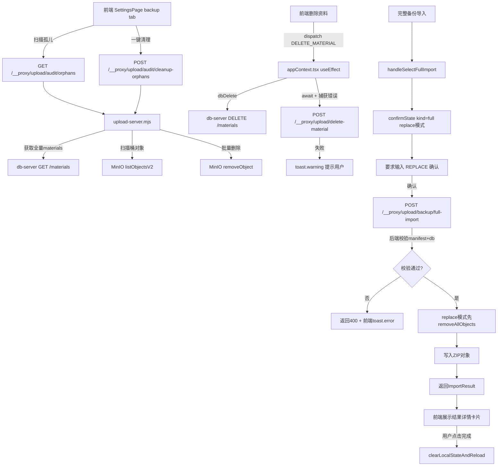

## 用户需求

基于数据一致性与备份恢复功能的审查结果，对当前项目进行三个方向的全面修订：

### 1. 强一致性删除

- 将 `appContext.tsx` 中的资料删除由 fire-and-forget 改为可感知失败：MinIO 清理失败时前端展示 toast 警告，说明数据库已删但 MinIO 可能残留，建议通过孤儿对象清理工具修复

### 2. 孤儿对象审计与清理工具

- 后端新增 `GET /upload/audit/orphans` 接口：扫描 MinIO 中有对象但 DB 无对应 material 记录的孤儿对象，返回数量、路径列表、总大小
- 后端新增 `POST /upload/audit/cleanup-orphans` 接口：批量删除孤儿对象并返回清理结果
- 前端在备份监控 Tab 新增"孤儿对象审计"区块，展示孤儿对象列表（objectName、size、所属桶），提供"扫描"和"一键清理"按钮，清理前需二次确认弹框

### 3. 备份恢复全面补强

- **导入前校验**：完整资产导入前校验 manifest 完整性（version、materialsCount、dbFile 字段是否合法），校验 db/db-data.json 是否为合法 JSON 且含 materials 键，若不合法则阻断并提示
- **恢复结果详情**：导入成功后不再只显示 toast，改为在页面内展示操作结果详情卡片（importedObjects 数、removedExistingObjects 数、skippedObjects 数、materialsCount 数、backupPath），确认关闭后再触发页面刷新
- **恢复前快照保护**：replace 模式下的完整资产导入，在提示文案中明确告知"MinIO 原始桶和解析桶将被完全清空，且无法自动回滚（db-server 已自动创建 .bak 备份，MinIO 文件不可回滚）"，同时要求用户在确认框中输入 `REPLACE` 字符串后方可执行，防止误点

## 技术栈

- 后端：Node.js ESM（`upload-server.mjs`、`db-server.mjs`），已有 MinIO SDK `minio`，保持现有模式
- 前端：React + TypeScript + Tailwind CSS + Shadcn/lucide-react，保持现有组件和样式规范

## 实现策略

### 强一致性删除

`appContext.tsx` 当前在 `useEffect` 监听 `state.materials` 变化时 fire-and-forget 调用 `/__proxy/upload/delete-material`。改法：改为 `await` 并捕获错误，失败时调用 `toast.warning` 提示"MinIO 文件清理失败，建议前往备份监控页扫描孤儿对象"。注意：**不回滚数据库**——因为回滚会把数据库恢复同时触发新一轮 useEffect 写操作，形成循环。失败静默记录 + 告知用户是最安全的方式。

由于 `useEffect` 本身是同步触发的，改为异步感知需要将清理逻辑提取成独立 async IIFE，不影响 useEffect 的其他逻辑（差量 upsert 部分继续 fire-and-forget）。

### 孤儿对象审计接口

后端 `upload-server.mjs` 新增两个接口：

**`GET /audit/orphans`**：

1. 调用 `db-server GET /materials` 获取全量 materials（含 metadata），提取所有 `metadata.provider === 'minio'` 的 material 的 ID 集合
2. 用 `listAllObjects(rawBucket, 'originals/')` + `listAllObjects(parsedBucket, 'parsed/')` 扫描 MinIO
3. 比对：MinIO 路径的第二段（`originals/{id}/` 中的 id）若不在 DB 的 materialId 集合中，则为孤儿
4. 返回 `{ orphans: [{ bucket, objectName, size }], totalSize, totalCount }`

**`POST /audit/cleanup-orphans`**：

1. 接受 body `{ objectNames: string[], buckets: string[] }` 或直接调用内部 orphan 扫描后批量删除
2. 调用 `removeAllObjects` 针对各孤儿对象执行删除
3. 返回 `{ removed, errors, totalSize }`

复用已有的 `listAllObjects`、`removeAllObjects`、`getMinioClient` 工具函数，无需引入新依赖。

### 前端孤儿对象区块

在 `SettingsPage.tsx` 的 backup tab 中增加"孤儿对象审计"区块，包含：

- 状态：`orphanStats: { totalCount, totalSize, orphans: [{bucket, objectName, size}] } | null`，`orphanLoading: boolean`
- "扫描孤儿对象"按钮 → `GET /__proxy/upload/audit/orphans`
- 扫描结果展示列表（最多展示 50 条，超出提示总数）
- "一键清理"按钮（有孤儿对象时激活）→ 触发确认弹框，确认后调用 `POST /__proxy/upload/audit/cleanup-orphans`，清理完成后刷新统计

### 备份恢复补强

**前置校验（前端侧）**：

- JSON 元数据导入：`handleImportBackup` 中解析 JSON 后校验是否含 `materials` 字段（object 类型），校验失败直接 toast.error 阻断，不弹 confirmState
- 完整资产导入：前端无法预校验 ZIP 内容，改在 `handleSelectFullImport` 中增加文件大小检查（>0 且文件名 `.zip`），其余校验在后端处理

**后端前置校验（upload-server.mjs `/backup/full-import`）**：

- 解析 manifest 后校验 `version`、`materialsCount >= 0`、`dbFile` 非空
- 校验 db JSON 含有 `materials` 键且为 object
- 校验失败提前 `res.status(400).json({ error: '...' })` 返回，不进行任何 MinIO 操作

**恢复结果详情（前端侧）**：

- 新增 state `importResult: ImportResult | null`（含 mode、importedObjects、removedExistingObjects、skippedObjects、materialsCount、backupPath）
- 导入成功后将结果存入 `importResult`，渲染"恢复完成"详情卡片，用户点击"完成"后执行 `clearLocalStateAndReload()`，不再自动刷新

**replace 模式二次输入保护**：

- 在 `BackupConfirmState` 的 `kind === 'full' && mode === 'replace'` 分支：渲染确认框时额外增加一个文本输入框，要求用户输入 `REPLACE` 才能激活确认按钮
- 提示文案中补充"MinIO 文件不可回滚，db-server 已创建 .bak 备份"

## 实现注意事项

- `appContext.tsx` 中 `useEffect` 的 cleanup 改为 async IIFE 时，需用 `void` 包裹避免 ESLint 的 async-effect 警告，遵循项目现有模式
- 孤儿对象判定逻辑：通过路径 `originals/{materialId}/xxx` 提取 materialId，需用 `split('/')` 取第二段并转为数字进行匹配，注意历史数据中可能存在路径不规范的对象（直接在根目录的），应将其计入孤儿
- `/audit/orphans` 接口调用 db-server 获取 materials 时使用内部地址 `DB_BASE_URL`，设置 5s 超时，失败时返回 500 而非静默
- 孤儿对象清理不依赖前端传入的 objectNames 列表（避免被篡改），改为后端重新扫描后直接清理，确保安全性
- 恢复结果详情的 `ImportResult` 类型定义在 `SettingsPage.tsx` 顶部本地定义，不需要改动全局 types
- replace 模式确认输入框使用受控 state（`confirmInput: string`），按钮 disabled 条件为 `confirmInput !== 'REPLACE'`

## 架构图



## 文件改动清单

```
server/
├── upload-server.mjs   [MODIFY] 新增 GET /audit/orphans、POST /audit/cleanup-orphans；
│                                 /backup/full-import 增加 manifest + db 数据结构校验
src/
├── store/
│   └── appContext.tsx   [MODIFY] 改强一致性删除：fire-and-forget → async IIFE + toast.warning on failure
└── app/
    └── pages/
        └── SettingsPage.tsx  [MODIFY] 新增孤儿对象审计区块（扫描/展示/清理）；
                                        replace 模式添加 REPLACE 文字输入保护；
                                        导入结果由自动刷新改为详情卡片展示后手动确认刷新；
                                        前置校验 JSON 元数据 materials 字段
```