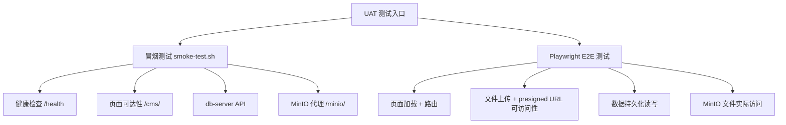
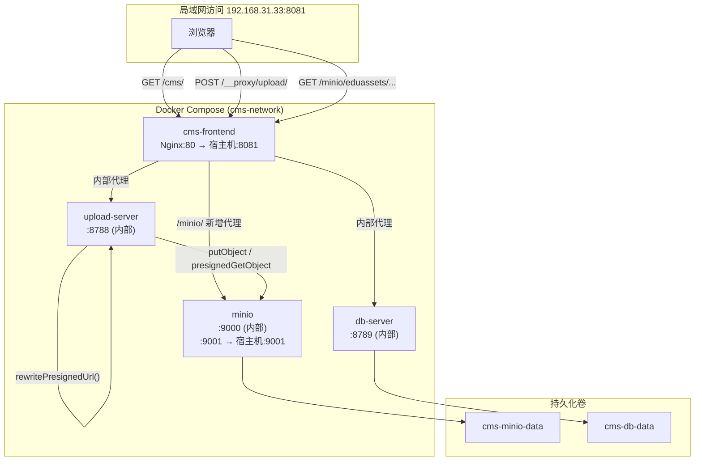

## 用户需求

为 EduAsset CMS 项目（Luceon2026）制定完整的 Docker 部署方案，实现以下目标：

### 产品概述

将现有多容器 CMS 系统部署到局域网，使局域网内任意设备均可通过 `http://192.168.31.33:8081` 访问完整功能，同时支持手动 + 自动化 UAT 端到端测试。

### 核心功能

**1. 端口适配**
将对外访问端口从默认 8080 改为 8081，通过 `.env` 文件固化配置，局域网用户访问 `http://192.168.31.33:8081/cms/` 即可正常使用系统。

**2. MinIO 文件访问修复（最关键）**
当前 MinIO 生成的预签名 URL 包含容器内部地址 `minio:9000`，局域网浏览器无法解析。需通过以下方案解决：

- Nginx 新增 `/minio/` 反向代理路径，转发至内部 MinIO `9000` 端口
- upload-server 引入 `MINIO_PUBLIC_ENDPOINT` 环境变量，将生成的预签名 URL 中的内部地址统一替换为公开地址 `http://192.168.31.33:8081/minio`
- 对全部 5 处 `presignedGetObject` 调用点统一处理，避免遗漏

**3. Nginx 补充 mineru-local 代理**
生产环境 Nginx 缺少 `/__proxy/mineru-local/` 代理配置（本地 MinerU 服务 `192.168.31.33:8083`），补充该 location 块，与开发环境 vite proxy 对齐。

**4. UAT 测试支持**

- 手动测试：提供一键启动脚本和访问地址清单，明确说明各功能模块验证路径
- 自动化测试：提供基于 Playwright 的端到端测试套件，覆盖核心功能（页面加载、文件上传、数据持久化、MinIO 文件访问），可在 CI 或本地一键执行
- 冒烟测试脚本：基于 curl 的轻量级服务健康验证，用于部署后快速确认各服务链路通畅

**5. 数据卷灵活管理**
提供保留现有数据和全新部署两种操作方式，通过 README 明确说明，用户可按需选择。

## 技术栈

沿用现有项目技术栈，不引入新技术：

- **容器编排**：Docker Compose（现有 `docker-compose.yml` 扩展）
- **反向代理**：Nginx 1.27-alpine（现有 `docker/nginx.conf` 修改）
- **后端服务**：Node.js ESM（现有 `server/upload-server.mjs` 修改）
- **自动化测试**：Playwright（通过已有 `playwright-cli` skill 生成）
- **冒烟测试**：Shell + curl（轻量，无额外依赖）

---

## 实现思路

### 核心策略

以最小化改动原则修改现有文件，不重构现有架构，通过以下四个精准变更点解决所有问题：

1. **环境变量层（`.env`）**：固化 `CMS_PORT=8081` 和 `MINIO_PUBLIC_ENDPOINT`，所有配置集中管理
2. **代理层（`nginx.conf`）**：新增 2 个 location 块（`/minio/` 和 `/__proxy/mineru-local/`），无破坏性修改
3. **服务层（`upload-server.mjs`）**：引入一个纯函数 `rewritePresignedUrl(url)`，在所有 `presignedGetObject` 返回点统一调用，不改变函数签名和调用关系
4. **编排层（`docker-compose.yml`）**：为 upload-server 注入 `MINIO_PUBLIC_ENDPOINT` 环境变量，调整 MinIO 端口暴露策略

### MinIO Presigned URL 重写方案（关键设计）

在 `upload-server.mjs` 顶部读取 `MINIO_PUBLIC_ENDPOINT` 环境变量，定义统一重写函数：

```javascript
// MINIO_PUBLIC_ENDPOINT 示例：http://192.168.31.33:8081/minio
const MINIO_PUBLIC_ENDPOINT = process.env.MINIO_PUBLIC_ENDPOINT || '';

function rewritePresignedUrl(url) {
  if (!MINIO_PUBLIC_ENDPOINT || !url) return url;
  // 将 http://minio:9000 替换为公开地址（同时兼容 http/https）
  return url.replace(/^https?:\/\/[^/]+:\d+/, MINIO_PUBLIC_ENDPOINT);
}
```

此函数在全部 5 处 `presignedGetObject` 结果上调用，保持现有逻辑不变，仅做 URL 字符串替换。未配置 `MINIO_PUBLIC_ENDPOINT` 时自动跳过（向后兼容）。

### 测试架构



### 性能与可靠性

- Nginx `/minio/` 代理针对对象存储特征设置适当超时（`proxy_read_timeout 300s`）
- 保持现有健康检查机制和 `depends_on` 启动顺序不变
- `rewritePresignedUrl` 是纯字符串操作，零性能开销

---

## 实现细节

- `rewritePresignedUrl` 替换逻辑使用正则 `/^https?:\/\/[^/]+:\d+/` 匹配协议+主机+端口，兼容 MinIO 返回 http/https 两种格式
- MinIO 9001 控制台端口在 UAT 期间保留暴露（`9001:9001`），方便人工检查存储状态；9000 端口仅保留内部网络访问（注释掉外部映射）
- `.env` 中 `MINIO_ACCESS_KEY` / `MINIO_SECRET_KEY` 使用占位符提示，UAT 部署时需填入实际值
- Playwright 测试使用 `baseURL: 'http://192.168.31.33:8081'`，测试文件放置于 `uat/` 目录，与源码隔离
- 冒烟测试脚本 `uat/smoke-test.sh` 使用 `curl -f -s` 验证，失败时输出明确错误信息并以非零退出码结束，便于 CI 集成

---

## 架构设计



---

## 目录结构

```
/workspace/ops/Luceon2026/
├── .env                          # [新建] 固化 CMS_PORT=8081、MINIO_PUBLIC_ENDPOINT 等 UAT 部署配置
├── .env.example                  # [修改] 新增 MINIO_PUBLIC_ENDPOINT 字段说明
├── docker-compose.yml            # [修改] upload-server 新增 MINIO_PUBLIC_ENDPOINT 环境变量；MinIO 9000 端口仅内部暴露
├── docker/
│   └── nginx.conf                # [修改] 新增 /minio/ 反向代理 location；新增 /__proxy/mineru-local/ 代理 location
├── server/
│   └── upload-server.mjs         # [修改] 引入 rewritePresignedUrl() 函数，在全部 5 处 presignedGetObject 返回点调用
└── uat/
    ├── README.md                 # [新建] UAT 测试说明：环境准备、执行步骤、验证清单、数据保留/清空操作指南
    ├── smoke-test.sh             # [新建] Shell 冒烟测试：curl 验证健康检查、页面可达性、db API、MinIO 代理共 8 个检查点
    ├── playwright.config.ts      # [新建] Playwright 配置：baseURL 指向 192.168.31.33:8081，超时、报告配置
    └── tests/
        └── cms-uat.spec.ts       # [新建] E2E 测试用例：页面加载、导航路由、文件上传流程、MinIO presigned URL 可访问性、数据持久化
```

## Agent Extensions

### Skill

- **playwright-cli**
- 用途：生成 `uat/playwright.config.ts` 和 `uat/tests/cms-uat.spec.ts` 端到端测试文件，覆盖页面加载、文件上传、MinIO presigned URL 可访问性等核心 UAT 场景
- 预期结果：生成可直接执行的 Playwright 测试套件，包含正确的 `baseURL` 配置和完整测试用例