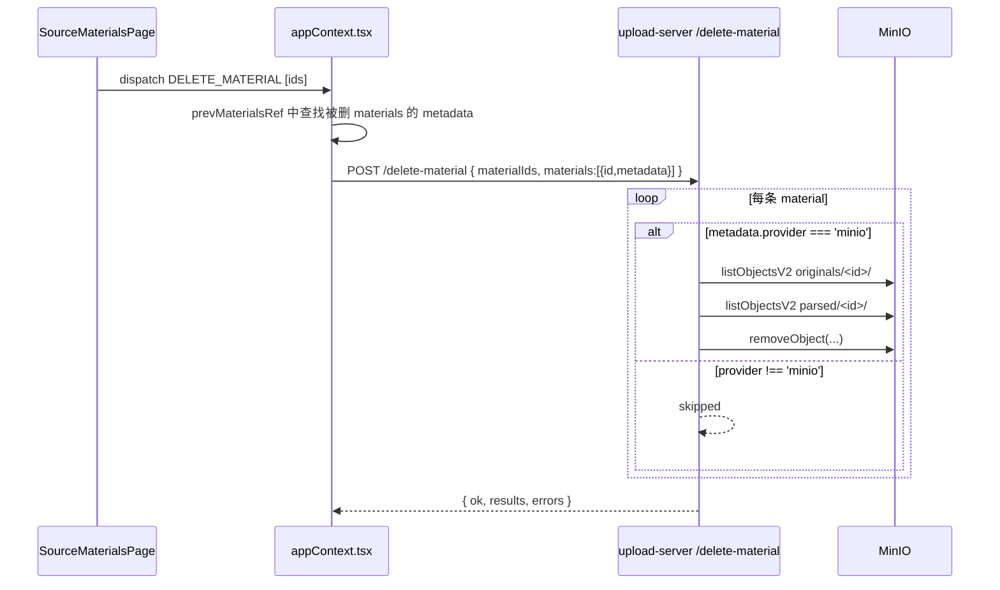

## 用户需求

修复 `/delete-material` 接口的设计 Bug：当前代码在删除 material 时，用全局运行时 `getStorageBackend()` 来决定是否清理 MinIO 文件，导致当系统当前后端为 `tmpfiles` 时，历史上用 `minio` 后端上传的文件永远无法被清理。

## 问题本质

"当前系统使用哪个后端" 和 "这条资料当时存在哪里" 是两件不同的事，不能混用。

## 产品概述

修复删除链路，使每条 material 的 MinIO 文件清理依据其自身 `metadata.provider` 字段决定，而非运行时全局配置。兼容旧版本的请求格式。

## 核心功能

- 前端 `appContext.tsx`：删除时将被删 materials 的 metadata（含 `provider`、`objectName`、`markdownObjectName`、`id`）一并传给后端
- 后端 `/delete-material`：按每条 material 自身的 `provider` 字段决定是否清理 MinIO；移除全局 `storageBackend` 跳过判断
- 兼容旧格式：后端同时支持只传 `materialIds` 的旧请求（降级为原来的全局判断行为）
- 对 `provider !== 'minio'` 的 material 静默标注 `skipped`，不报错

## 技术栈

- 前端：React + TypeScript（`src/store/appContext.tsx`）
- 后端：Node.js + Express（`server/upload-server.mjs`，ESM）
- 存储：MinIO SDK（`minio` npm 包）

## 实现思路

### 修改点 1 — 前端 `appContext.tsx`

在检测到 `deletedIds` 后，从 `state.materials` 在 effect 执行前（即 prevMaterialIds 记录的"上一轮"）取到被删 material 的完整对象。

**关键问题**：`state.materials` 在 effect 执行时已经是删除后的新状态，拿不到被删的 material。需要维护一个 `prevMaterialsRef`（`useRef<Material[]>`），在每轮 effect 结束前将 `state.materials` 记录下来，下一轮 effect 触发时从 `prevMaterialsRef.current` 中查找被删的 material metadata。

调用 `/delete-material` 时，`body` 改为同时传 `materialIds`（向后兼容）和 `materials`（新字段，包含 `id`、`metadata.provider`、`metadata.objectName`、`metadata.markdownObjectName`）。

### 修改点 2 — 后端 `upload-server.mjs`

重写 `/delete-material` handler：

1. 从 body 读取 `materials`（新格式）或降级读 `materialIds`（旧格式）
2. **移除** `if (getStorageBackend() !== 'minio') return skipped` 全局判断
3. 对每条 material：

- 若 `metadata.provider !== 'minio'`：标注 `{ id, skipped: true, reason: 'non-minio provider' }`，跳过
- 若 `metadata.provider === 'minio'`：按 `originals/<id>/` 和 `parsed/<id>/` 前缀列举并删除（原有逻辑，不变）

4. 旧格式（只有 `materialIds`）：沿用原来的 `getStorageBackend()` 检查，保持向后兼容

### 性能与可靠性

- MinIO 清理仍为 fire-and-forget，失败不阻塞 UI（前端已有 `.catch`）
- 后端每个 id 独立 try/catch，单条失败不影响其余
- 不引入新依赖，不改变其他接口

## 架构说明



## 目录结构

```
server/
└── upload-server.mjs        # [MODIFY] 修改 /delete-material 接口，移除全局 storageBackend 判断，
                             #   改为按每条 material 自身的 metadata.provider 决定清理策略；
                             #   同时保留旧格式（只有 materialIds）的向后兼容降级逻辑

src/store/
└── appContext.tsx            # [MODIFY] 新增 prevMaterialsRef（useRef<Material[]>），
                             #   在 materials effect 中，在检测删除后从 prevMaterialsRef.current
                             #   提取被删 material 的 metadata，连同 materialIds 一起传给 /delete-material；
                             #   在 effect 末尾更新 prevMaterialsRef.current = state.materials
```